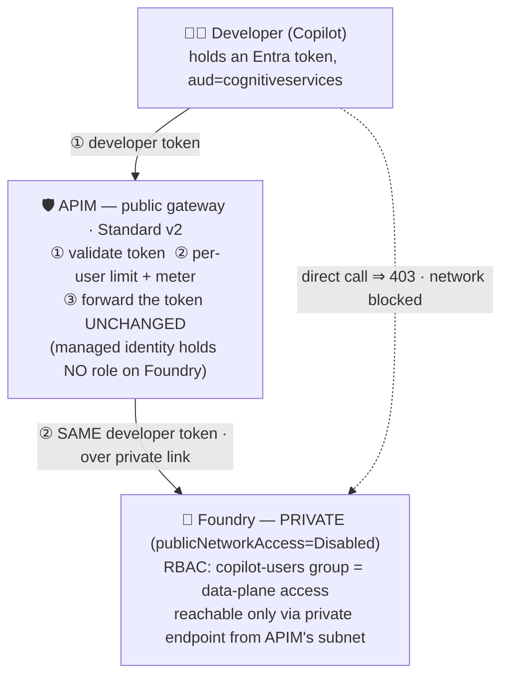
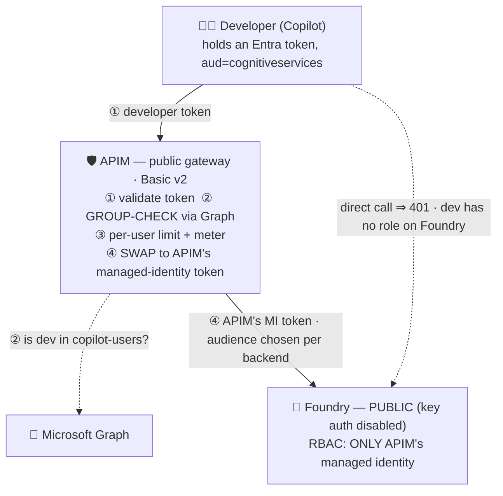

# Governed GitHub Copilot → Private Foundry Model (via Azure APIM)

Let developers use **our own Azure AI Foundry model inside GitHub Copilot** (keyless, Entra-only),
with a central **Azure API Management** gateway enforcing four things that don't come together out of
the box:

1. **Entra-only auth, no API keys** — developers never hold a model key.
2. **Per-user authorization** — only members of an approved security group may use it.
3. **Central governance** — per-developer token limits + usage metering for cost/audit.
4. **No bypass** — the model can only be reached through the gateway.

This repo contains **two working implementations**. They are identical except for **one design
decision**: at the gateway, does APIM call Foundry with **its own managed identity**, or does it
**pass the developer's token straight through**? That single choice cascades into *how authorization
works, what makes the gateway non-bypassable, whether Foundry can be public, and what shows up in the
audit log*. Everything below exists to let an architect weigh that one fork.

> **Identical in both** (so not a basis for choosing): APIM validates the Entra token, applies the
> per-user **TPM limit** and per-`oid`/`model` **metering**, and can apply per-model request policy.
> The differences are entirely in the **authorization** and **backend-call** mechanics described below.

---

## Option B — developer-token pass-through

APIM forwards the developer's **own** token, unchanged, to a **private** Foundry. Azure RBAC granted to
the user group authorizes the call at the resource; the **network** makes the gateway non-bypassable.



**How it works.** The token the developer already holds is the *same* token that reaches Foundry.
Foundry validates it and checks **its own RBAC**: a member of `copilot-users` is allowed; anyone else
is denied — natively, no gateway code. A developer who tries to skip APIM and hit Foundry directly is
stopped by the **network** (Foundry is private; its endpoint is reachable only from APIM's subnet).

**Strengths**
- **Native per-user identity at the resource** — Foundry's own logs record the real developer `oid`
  (non-repudiation/audit); Conditional Access and risk policies apply to the actual model access.
- **Authorization is platform-native RBAC** — no custom Microsoft Graph code, permission, or cache to
  build and certify; group access plugs into access reviews / PIM / entitlement management.
- **Least-privilege gateway** — APIM holds **no** standing Foundry credential, shrinking blast radius
  if the gateway is compromised.

**Trade-offs**
- **Requires private networking** — no-bypass rests entirely on the network boundary (private Foundry +
  NSG-scoped endpoint + Standard v2 VNet integration). A networking misconfiguration is the one way to
  silently bypass governance.
- **Authorization is the *union* of all Azure RBAC, including inherited** — a broadly-scoped or
  inherited data-plane role (e.g. a subscription-level grant) also confers access, so least-privilege
  requires auditing role assignments; the gateway is **not** the sole authority.
- **Single token audience** — the developer token reaches only the data-plane endpoint, so **model-router
  `/responses` is unsupported** (named-model responses work).

→ Details, IaC, and validation: [`infra-passthrough/`](infra-passthrough/README.md).

---

## Option A — APIM managed-identity swap

APIM **drops** the developer's token and calls Foundry with **its own managed identity**. Only APIM's
identity has a role on Foundry, so **identity** (not the network) makes the gateway non-bypassable —
which lets Foundry stay **public**.



**How it works.** APIM authenticates the developer, asks **Microsoft Graph** whether they're in
`copilot-users`, then **discards** their token and substitutes **its own managed-identity token** to
call Foundry. The developer has no RBAC role on Foundry, so a direct call is rejected (`401`) regardless
of the network — the gateway is the only way in.

**Strengths**
- **The gateway is the sole, complete authorization authority** — because the developer has no role on
  Foundry, APIM alone decides who gets in. No bypass via inherited RBAC, and the gateway can express
  *any* policy (group, per-model, time-of-day, …).
- **No private networking required** — no-bypass comes from identity, so Foundry can stay public and the
  cheaper Basic v2 tier suffices; robust to network misconfiguration.
- **Endpoint/audience flexibility** — because APIM mints the backend token per request, it can target
  different Foundry endpoints/audiences. This is what makes **model-router `/responses`** (which needs
  the `ai.azure.com` project endpoint) work.

**Trade-offs**
- **Bespoke authorization code** — the group check is a Microsoft Graph call needing an extra app
  permission, custom policy, and a membership cache (with its own staleness window) to build and assure.
- **Standing privileged credential** — APIM holds a Foundry data-plane role; larger blast radius than a
  gateway that holds none.
- **No per-user identity at the resource** — Foundry's logs see only APIM's managed identity, so
  per-developer attribution lives solely in APIM's metrics, not in native resource audit.

→ Details, IaC, and validation: [`infra/`](infra/README.md).

---

## Repository layout

```
README.md                 # this file — the design fork + pros/cons of each option
plan.md                   # original design write-up (Option A)
infra/                    # Option A — MI-swap (Basic v2, public Foundry)
infra-passthrough/        # Option B — pass-through (Standard v2 + VNet, private Foundry)
```

Each folder is a self-contained, reproducible deploy with its own README, `deploy.sh`,
`test-gateway.sh`, and client snippets.

## Deploy & validate

```bash
cp config.env.example config.env          # then fill in SUBSCRIPTION_ID / TENANT_ID / GROUP_OID
az login                                  # subscription Owner (+ Entra admin for Option A)
bash infra/deploy.sh                      # Option A  → apim-copilot-poc
#   …or…
bash infra-passthrough/deploy.sh          # Option B  → apim-copilot-poc-pt  (new RG, coexists)
```

> `config.env` (your real IDs) is **git-ignored** — never committed. The scripts read it
> automatically; resource names are non-secret defaults you can override there.

**Tear it down** (each option deletes its own resource group and purges the soft-deleted
Cognitive Services + APIM so their names free up; the shared group/test user are left intact):

```bash
bash infra-passthrough/cleanup.sh         # Option B  (the pricier one: Standard v2 + private endpoint)
bash infra/cleanup.sh                     # Option A
```

Both reuse the same `copilot-users` group and `copilotuser` test user, so you can stand them up
side-by-side, validate with `bash <folder>/test-gateway.sh` (device-code sign-in), and point VS Code
Copilot at either gateway via the folder's `chatLanguageModels.snippet.json`.
