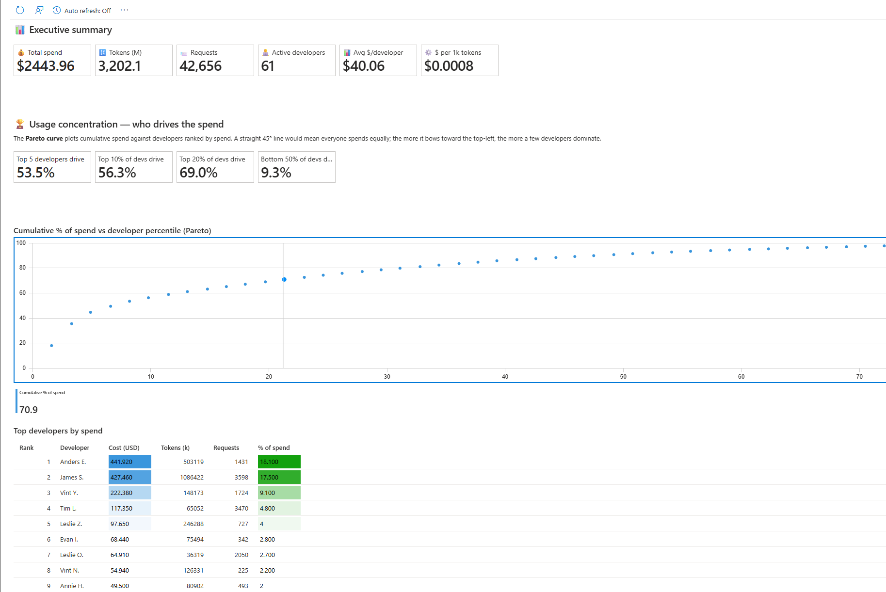
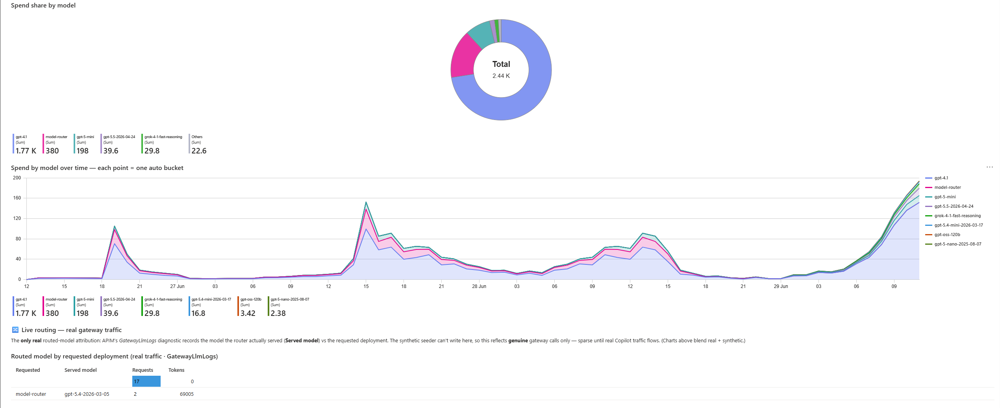
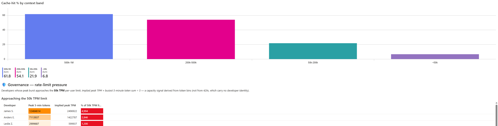
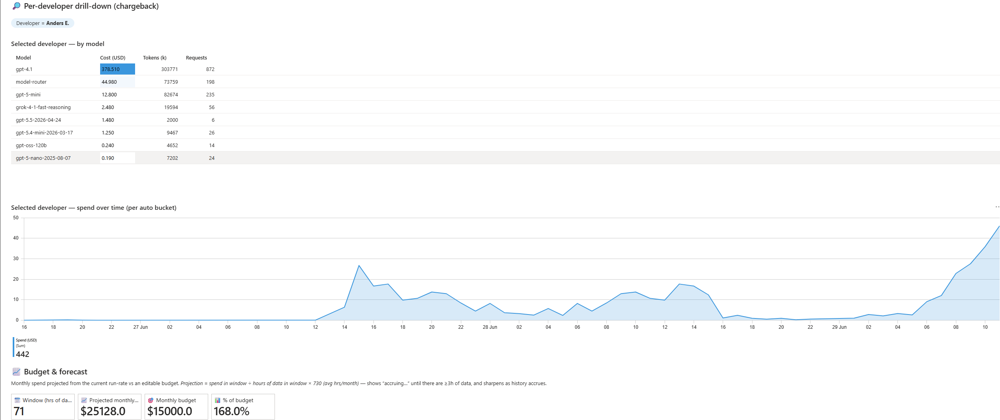

# FinOps dashboard — per-developer Copilot usage & cost

An Azure Monitor **Workbook** that turns the gateway's per-user token metrics into a FinOps view of
**GitHub Copilot → private Foundry** spend, attributed to the individual developer. It's built for the
question that defines coding-agent cost at scale:

> **Who is actually driving the spend?** — *a small share of developers typically accounts for most of
> the cost.* The workbook makes that concentration the headline.

It reads the same telemetry the APIM `llm-emit-token-metric` policy already emits — metrics
`Total/Prompt/Completion Tokens` with dimensions `oid` (developer), `developerName`, and `model` — so
the per-developer dashboard needs **no gateway changes**. (One optional widget, *Live routing*, additionally
reads APIM's `GatewayLlmLogs` diagnostic — see [How it's tracked](#how-its-tracked-the-gateway-policies).)
It defaults to Option A (`infra/`, App Insights `appi-copilot-poc`), but the pass-through deployment
(`infra-passthrough/`) emits the **identical** telemetry, so the same workbook serves both — just point
the scripts at the `-pt` resources ([see below](#pointing-it-at-the-pass-through-deployment-infra-passthrough)).

## What it looks like

> Shown here populated with the **synthetic demo fleet** (`seed-usage.py`) — illustrative shapes, not
> real spend. The *Live routing* table is the one exception: it shows genuine gateway traffic.

**Executive summary + usage concentration** — headline spend / token / developer KPIs, the Pareto curve,
and the top-developer leaderboard that answers *"who drives the spend?"*:



**Model mix + live routing** — spend share and trend by model, plus the *Live routing* table where APIM's
`GatewayLlmLogs` reveals the real model `model-router` actually served per request:



**Caching + governance** — cache-hit rate by context-size band, and the developers whose peak burst
approaches the per-user **50k TPM** limit:



**Per-developer chargeback + forecast** — a single developer's spend by model and over time, plus a
run-rate projection against an editable monthly budget:



## What it shows

| Section | Widgets |
|---|---|
| **Executive summary** | total spend · tokens · requests · active developers · avg $/dev · blended $/1k tokens |
| **Usage concentration** | "top 5 devs / top 10% / top 20% drive X%" tiles · **Pareto curve** · top-N leaderboard · spend-distribution histogram |
| **Model mix & efficiency** | cost & tokens by model · avg tokens/request · `$/1k` per model · spend-over-time trend (selectable bucket: auto/5m/hourly/daily) · **Live routing** — real served-model vs requested deployment from `GatewayLlmLogs` |
| **Usage timing** | day-of-week × hour-of-day **heatmap** (CEST) — work-hours / weekday concentration |
| **Context window & caching** | request distribution by context band (<50k … 500k–1M) · developers by typical context · **cache-hit rate & $ saved** · **cache-hit % by context band** (long-context → more cache) |
| **Governance** | developers whose burst implies sustained throughput near the **50k TPM** per-user limit |
| **Per-developer drill-down** | pick a developer → their model breakdown and spend trend (chargeback) |
| **Budget & forecast** | run-rate projection of monthly spend vs an editable budget |

Cost is a **token × price** estimate that **discounts cached input tokens** (the gateway already emits
a `Prompt Cached Tokens` metric — no policy change needed). Prices are an **editable parameter** (USD
per 1M tokens: `inP` input, `outP` output, `cachedP` cached-input) defaulting to list-price
placeholders (cached ≈ 10–25% of input) — change them to your negotiated rates. A model with no price-table
entry falls back to a blended default, so cost never goes blank when the router serves a new model.

## How it's tracked (the gateway policies)

Two independent gateway mechanisms feed the dashboard — it helps to know which does what:

| Mechanism | Runs | Lands in | Tracks |
|---|---|---|---|
| [`llm-emit-token-metric`](https://learn.microsoft.com/azure/api-management/llm-emit-token-metric-policy) policy | inbound | App Insights `customMetrics` | per-request **token counts** (prompt / completion / total / cached) tagged with `oid`, `developerName`, `model`. **This is the FinOps engine** — every per-developer widget runs on it. |
| [`llm-token-limit`](https://learn.microsoft.com/azure/api-management/llm-token-limit-policy) policy | inbound | enforced inline | the per-developer **50k TPM** ceiling the *Governance* view reasons about. |
| [`GatewayLlmLogs`](https://learn.microsoft.com/azure/api-management/api-management-howto-llm-logs) diagnostic | resource log → Log Analytics | `ApiManagementGatewayLlmLog` | per-request **served model** (`ModelName`) vs requested deployment (`DeploymentName`) + token counts. The **only** place the model-router routed model is captured. Enabled token+model only — *no prompt/completion bodies* (no PII, low cost). |

### Why model-router cost comes from two sources

`llm-emit-token-metric` runs **inbound**, before the response exists — so the `model` it records is the
*requested* deployment. For a router call that's literally `"model-router"`, never the model that actually
served (and billed). The served model is only in the **response** (`model` field, also in every stream
chunk). Consequently:

- **Per-developer cost** (concentration, leaderboard, governance, drill-down) comes from `customMetrics`,
  where router traffic is one blended `model-router` bucket.
- **Routed-model attribution** comes from `GatewayLlmLogs` — real, but it has no developer identity, so it
  can't be joined per-developer. That's the *Live routing* widget.
- For the **demo**, `seed-usage.py` writes the *served* underlying model straight into `customMetrics` (it
  controls the data), so the model-mix / `$`/model / trend charts show a realistic routing split — using the
  real pool this deployment routes to (grok-4-1-fast-reasoning, gpt-5.x-mini/nano, gpt-oss-120b, …).

Enabling routed-model logging on your own gateway takes **two** steps (the resource diagnostic alone
emits nothing — the per-API LLM toggle is also required):

```bash
APIM_ID="$(az apim show -n <apim> -g <rg> --query id -o tsv)"
# 1) route GatewayLlmLogs to a Log Analytics workspace.
#    --export-to-resource-specific true is REQUIRED: without it the data lands in the legacy
#    AzureDiagnostics table (as columns deploymentName_s / modelName_s), NOT ApiManagementGatewayLlmLog,
#    and the widget below stays empty even though logging works. (First rows take ~15 min to appear.)
az monitor diagnostic-settings create --name llm-gateway-logs \
  --resource "$APIM_ID" --workspace "<log-analytics-workspace-id>" \
  --export-to-resource-specific true \
  --logs '[{"category":"GatewayLlmLogs","enabled":true}]'
# 2) turn on LLM logging for the API — logs:"enabled" = token usage + served model name ONLY
#    (omit requests/responses => no prompt/completion bodies => no PII, low ingestion cost)
az rest --method put \
  --url "https://management.azure.com$APIM_ID/apis/<api>/diagnostics/azuremonitor?api-version=2024-05-01" \
  --headers "Content-Type=application/json" \
  --body '{"properties":{"loggerId":"'"$APIM_ID"'/loggers/azuremonitor","largeLanguageModel":{"logs":"enabled"}}}'
```

> The seeder emits **one row per request** (`valueCount==1`), exactly like real gateway traffic, so the
> request-band and cache widgets work identically on synthetic and real data. Older aggregated demo rows
> (`valueCount>1`) are automatically excluded from the per-request widgets.

## Quick start

```bash
cp ../config.env.example ../config.env     # if you haven't already (RG / app name optional overrides)
az login                                   # reader on rg-copilot-foundry-poc is enough

python3 seed-usage.py                       # 1) seed a synthetic developer fleet (see note below)
bash deploy-finops.sh                       # 2) publish the workbook (idempotent)
```

Then open **Azure portal → Monitor → Workbooks → "Copilot FinOps — per-developer usage & cost"**
(or the `appi-copilot-poc` resource → Workbooks). Adjust the **Time range**, **Models**, **Price
table** and **Budget** parameters at the top; everything recomputes live.

### Pointing it at the pass-through deployment (`infra-passthrough/`)

`infra/` is only the default. PoC #2 emits the **same** telemetry — identical `llm-emit-token-metric`
dimensions (`oid` / `developerName` / `model`) and the same `GatewayLlmLogs` setup — so this workbook
works against it unchanged. Both `seed-usage.py` and `deploy-finops.sh` read their resource names from
env vars, so just point them at the `-pt` resources:

```bash
export RG=rg-copilot-foundry-poc-pt APPINSIGHTS_APP=appi-copilot-poc-pt SVC=apim-copilot-poc-pt
python3 seed-usage.py        # seed that deployment's App Insights
bash deploy-finops.sh        # publish the workbook into the -pt resource group
```

(Per-developer metering and routed-model capture are the same on both. Pass-through just doesn't support
model-router `/responses` — data-plane only — which the dashboard doesn't depend on.)

## How the demo data works (and the ingestion limit)

The dashboard is driven by real `customMetrics` rows. In a PoC there's only one real test user, so
`seed-usage.py` manufactures a believable fleet (~60 developers, lognormal activity → Pareto
concentration, per-developer model mix, business-hours shape) and **POSTs it to the same App Insights
ingestion endpoint** the gateway uses, with the **same schema** (`customDimensions.oid` / `model` — the
*served* model — plus synthetic-only `developerName` and `requestedModel` labels). The workbook cannot tell synthetic rows
from real gateway telemetry — and real `copilotuser` traffic, if any, shows up right alongside.

**Ingestion window:** the App Insights ingestion endpoint **drops any record older than ~60 minutes**
(newer rows keep their timestamp). So:

- One `seed-usage.py` run fills a rolling **~55-minute window** — enough for *every* widget except a
  long trend (concentration, leaderboards, cost and model mix don't depend on history).
- To grow a genuine **multi-day trend**, you can't backfill — you keep emitting "now". That's what the
  **heartbeat** does.

> The "30-day" figures in Azure docs are *retention* (how long data is kept once stored), not how far
> back a record may be timestamped. Backdating here is capped at ~1h regardless of retention.

## Heartbeat — growing a real trend (optional)

`deploy-heartbeat.sh` builds the seeder image in the cloud (`az acr build`, no local Docker) and runs
it as a **scheduled Azure Container Apps Job** (default every 30 min) that emits a fresh "now" slice
each time. Leave it running for a day or two and the trend line fills out with genuine, diurnally-shaped
history. It scales to zero between runs (a few cents/day) and lives in the same resource group, so the
existing `infra/cleanup.sh` tears it down with everything else.

```bash
bash deploy-heartbeat.sh
az containerapp job start -n finops-seeder -g rg-copilot-foundry-poc   # optional: run one now
az containerapp job execution list -n finops-seeder -g rg-copilot-foundry-poc -o table
# pause but keep data:
az containerapp job update -n finops-seeder -g rg-copilot-foundry-poc --trigger-type Manual
```

## Files

| File | Purpose |
|---|---|
| `workbook.json` | The workbook definition (paste into the portal's Advanced Editor, or deploy below). |
| `workbook.template.json` | ARM template wrapping a `microsoft.insights/workbooks` resource. |
| `deploy-finops.sh` | Resolves the App Insights id, injects it, deploys the workbook (idempotent). |
| `seed-usage.py` | Synthetic per-developer usage generator (stdlib only). |
| `Dockerfile` + `deploy-heartbeat.sh` | The scheduled Container Apps Job that keeps the trend growing. |

## Caveats

- **Synthetic figures** — illustrative volumes; the *shape* (concentration, model mix) is the point,
  not the absolute dollars. Edit the **Price table** parameter for real rates.
- **model-router attribution is split across two sources** — the token metric only sees the *requested*
  name `model-router`; the real served model lives in `GatewayLlmLogs`. See
  [How it's tracked](#how-its-tracked-the-gateway-policies). On synthetic data the served model is simulated
  into `customMetrics`; on real traffic the per-developer charts show `model-router` blended, and the *Live
  routing* widget shows the true served model.
- **Forecast needs history** — the monthly projection shows "accruing…" until there are ≥3h of data;
  it sharpens as the heartbeat accumulates a representative run-rate.
- **Governance is derived, not a 429 log** — per-user rate-limit attribution isn't in standard
  telemetry, so the governance view infers pressure from token bins vs the 50k TPM limit.
- **Query schema** — the workbook binds to the App Insights **component** and reads the classic
  `customMetrics` / `customDimensions` schema, which both deployments expose (both are workspace-based).
  The same rows also appear as `AppMetrics` / `Properties` when you query the linked Log Analytics
  workspace directly.

## Teardown

The workbook and heartbeat resources are all in `rg-copilot-foundry-poc`, so `bash ../infra/cleanup.sh`
removes them. To drop just the workbook:
`az resource delete --ids $(az resource list -g rg-copilot-foundry-poc --resource-type microsoft.insights/workbooks --query "[0].id" -o tsv)`.
Synthetic telemetry already in App Insights ages out with the workspace retention.
