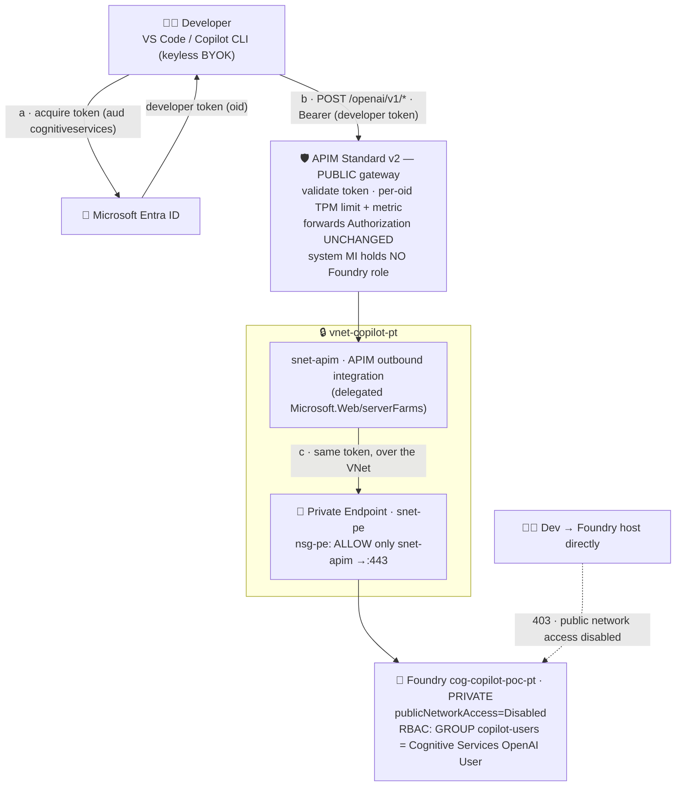
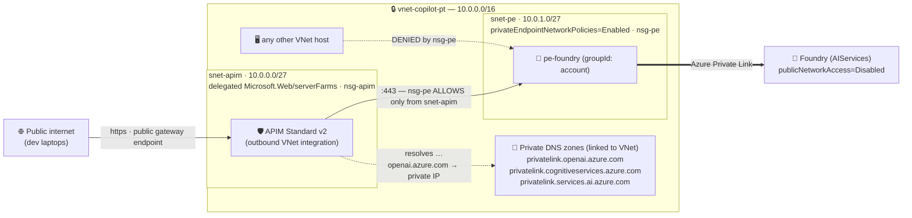
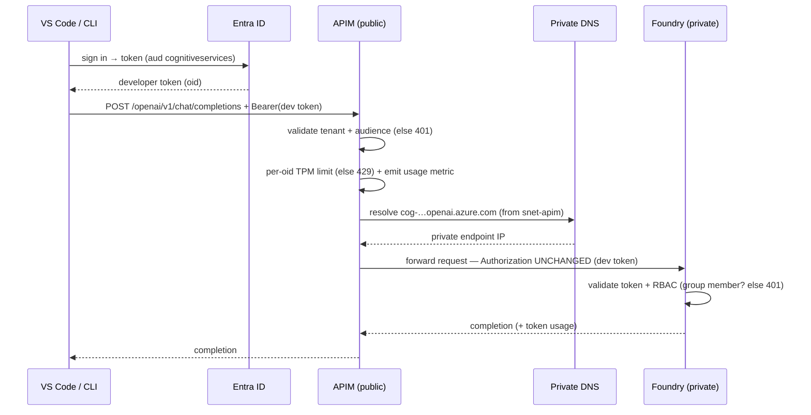
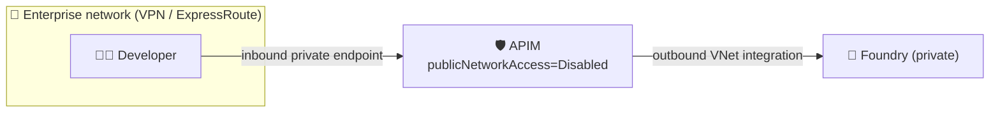

# Option B — pass-through (network-enforced no-bypass)

> Part of [Governed GitHub Copilot → Private Foundry via APIM](../README.md). This is **Option B**:
> APIM forwards the **developer's own token** to a **private** Foundry; **Azure RBAC on the group**
> authorizes, and the **network** makes the gateway non-bypassable. For the identity-enforced
> alternative (MI-swap, public Foundry), see [`infra/`](../infra/README.md) (**Option A**).

Reaches the **same goal** as Option A — developers use a private Foundry model in GitHub Copilot,
governed by a central gateway — but with an enforcement model that fits an enterprise (e.g. FSI) that
runs **private networking by default** and treats the network as one defense-in-depth layer.

| | **Option A** ([`../infra/`](../infra/README.md)) | **Option B** (this folder) |
|---|---|---|
| Who calls Foundry | APIM's **managed identity** (dev token dropped) | the **developer's own token**, forwarded unchanged |
| Foundry RBAC holder | only APIM's MI | the **`copilot-users` group** |
| Authorization | custom **Graph group-check** in APIM (cached 1 h) | native **Azure RBAC** on the group |
| "No bypass" enforced by | **identity** (dev has no role) | **network** (Foundry private, reachable only from APIM) |
| Foundry network | public | **private** (`publicNetworkAccess=Disabled` + private endpoint) |
| APIM tier | Basic v2 | **Standard v2** (needed for outbound VNet integration) |
| Per-user audit at the resource | everyone = one MI in Foundry logs | **real developer `oid`** in Foundry logs |

**Why this model for FSI:** native per-user identity for audit/non-repudiation, platform-enforced
authz (no bespoke Graph code to certify), a least-privilege gateway (APIM holds **no** standing
Foundry credential), and Conditional Access applied to the actual resource access. The trade is that
no-bypass now rests on the network boundary instead of identity — acceptable when private networking
is the baseline anyway.

---

## Architecture

The developer's own Entra token (audience `cognitiveservices`) is forwarded **unchanged** all the way
to a **private** Foundry. APIM keeps only validate + per-user limit + metering; authorization is native
Azure RBAC on the group; and no-bypass is enforced by the network.



The developer **does** hold a Foundry role now — so a direct call would succeed *if it could reach
Foundry*. It can't: Foundry is private and its endpoint is NSG-locked to APIM's subnet, so neither the
laptop nor any other VNet host can skip the gateway.

### Network architecture



### Request lifecycle



### Note: the APIM gateway can be private too

This PoC exposes APIM on its **public** gateway endpoint — the simplest setup for laptops and BYOK
clients, and the public surface is still fully governed (validate → limit/meter → RBAC → private
backend). But the gateway is **not required** to be public. For an enterprise that wants the gateway
reachable **only from the corporate network**, APIM can be locked down without changing anything
downstream:

- **Standard v2** — add an **inbound private endpoint** to APIM and set its `publicNetworkAccess =
  Disabled`; clients reach it over VPN/ExpressRoute. (Outbound VNet integration to Foundry is
  unchanged.)
- **Premium v2** — use **VNet injection** for fully private inbound **and** outbound in one resource.



Everything else in this PoC (pass-through token, group RBAC, private Foundry, metering) is identical;
only APIM's *inbound* exposure changes.

---

## What it governs (unchanged from Option A)

- **Per-user rate limit** — `llm-token-limit` keyed on the Entra `oid` (50k TPM/user) → 429.
- **Per-user/-model metering** — `llm-emit-token-metric` to App Insights (`appi-copilot-poc-pt`).
- **Authentication** — `validate-azure-ad-token` (tenant + `cognitiveservices` audience) → 401.
- **Authorization** — now native: RBAC on the group → 403 from Foundry for non-members.

---

## Deploy it

```bash
az login              # subscription Owner (assigns the group RBAC role + creates networking)
bash infra-passthrough/deploy.sh   # ~10-15 min (APIM Std v2 provisioning + VNet integration dominate)
```

**Tear it down** (this option costs the most — Standard v2 APIM + private endpoint):

```bash
bash infra-passthrough/cleanup.sh  # deletes the RG + purges soft-deleted Foundry/APIM; -y to skip the prompt
```

`deploy.sh` builds, in order: RG → VNet + `snet-apim` (delegated) + `snet-pe` + NSGs → Foundry +
`gpt-4.1`/`model-router`/`gpt-5-mini` → private endpoint + 3 private DNS zones + **disable public
access** → App Insights → APIM Standard v2 + **outbound VNet integration** → **grant the group
`Cognitive Services OpenAI User`** → API + operations → App Insights wiring → pass-through policy.

> **RBAC propagation:** data-plane role assignments take **~5–30 min** to take effect. The first
> validation run right after deploy may 403 until propagation completes — just re-run.

It **reuses** the existing `copilot-users` group (`<group-object-id>`) and `copilotuser` test user from
Option A; only the new Foundry account receives the group role.

---

## Validate it

```bash
bash infra-passthrough/test-gateway.sh   # device-code sign-in as copilotuser when prompted
```

| Test | Expected | Enforced by |
|---|---|---|
| No token → APIM | **401** ✓ | APIM `validate-azure-ad-token` |
| `copilotuser` → APIM · `/chat/completions` gpt-4.1 & model-router | **200** ✓ | RBAC (group) |
| `copilotuser` → APIM · `/responses` gpt-4.1 & gpt-5-mini | **200** ✓ | RBAC (group), data-plane |
| `copilotuser` → APIM · `/responses` **model-router** | **400** ✓ (data-plane only) | — |
| Out-of-group, **no** Foundry role → APIM | **401** (`PermissionDenied`) | **Foundry RBAC** (not APIM) |
| Out-of-group **but holds an inherited data-plane role** (e.g. admin = subscription `Foundry User`) → APIM | **200** ⚠️ | **Foundry RBAC union** — see caveat |
| **Bypass:** token direct to `cog-copilot-poc-pt.openai.azure.com` | **403 public-network-access-disabled** ✓ | **Network** |
| Exceed per-user TPM | **429** | APIM `llm-token-limit` |
| Per-user metering | metrics by `oid`/`model` in `appi-copilot-poc-pt` | APIM `llm-emit-token-metric` |

The two rows that change **mechanism** vs Option A are the headline of this option: authorization is now
**Foundry RBAC** (not an APIM Graph check), and bypass is blocked by **network** (not identity/401).

> ⚠️ **Authorization is the *union* of all Azure RBAC that grants Foundry data-plane access — including
> inherited assignments.** A principal that is **not** in `copilot-users` but holds a subscription-scoped
> **`Foundry User`** role still gets `200`, because that role inherits down to the account. In Option A
> the APIM Graph group-check is the *sole* gate and would block it; here, anyone with a broadly-scoped or
> inherited data-plane role gets in regardless of group membership.
> **Consequence for least-privilege:** to make group membership the *effective* boundary, audit and
> remove broader data-plane assignments (subscription/MG-level `Foundry User` / `Cognitive Services
> OpenAI User`), or keep an APIM group-check as belt-and-suspenders. This is a real, concrete
> trade-off vs Option A's gateway-enforced boundary.

**Query per-user/-model usage** (verified working). This App Insights is **workspace-based**, so the
metrics land in the Log Analytics `AppMetrics` table (not the classic `customMetrics`):

```kusto
AppMetrics
| where TimeGenerated > ago(1d)
| where Name in ('Total Tokens','Prompt Tokens','Completion Tokens')
| extend oid = tostring(Properties.oid), model = tostring(Properties.model)
| summarize tokens = sum(Sum), requests = sum(ItemCount) by Name, oid, model
| order by Name asc
```

(Run it against the component's workspace, e.g. `az monitor log-analytics query -w <workspace-GUID> --analytics-query "<above>"`. The classic `customMetrics`/`requests` tables stay empty for workspace-based components — that's a query-schema gotcha, not a metering failure.)

**Native audit (the headline benefit):** enable a diagnostic setting on the Foundry account
(`RequestResponse` category → Log Analytics) and you'll see the **real `copilotuser` oid** on every
inference call — impossible in Option A, where every call is attributed to APIM's single managed
identity.

---

## Use it from a client

Same as Option A, only the host changes to `apim-copilot-poc-pt.azure-api.net`:
- **VS Code Copilot** — `infra-passthrough/chatLanguageModels.snippet.json`.
- **Copilot CLI** — `infra-passthrough/copilot-cli.env.sh` (keyless `azure` provider recommended).

---

## Limitations / caveats

- **model-router `/responses` is unsupported.** A passed-through token has a single audience
  (`cognitiveservices`), which reaches only the data-plane endpoint. model-router's `/responses`
  lives on the Foundry **project** endpoint (`ai.azure.com` audience), which a pass-through token
  can't reach. Named-model `/responses` (gpt-4.1, gpt-5-mini) works. If full parity is ever needed,
  the future option is **OBO token-exchange** at the gateway (keeps user identity, fixes the
  audience) — at the cost of a confidential-client app + secret.
- **Revocation is propagation-bound (~5–30 min), not real-time.** Removing a user from the group
  revokes access after RBAC propagation; **CAE is not a Cognitive Services data-plane feature**, so
  there's no instant kill-switch at Foundry.
- **No-bypass depends on the `nsg-pe` scoping.** The "only `snet-apim` may reach the PE" rule is
  load-bearing — a misconfiguration there is the one way to silently bypass governance (the trade vs
  Option A's identity-enforced boundary).
- **Standard v2 costs more than Basic v2** (required for outbound VNet integration). Fine for a PoC.
- **Inline (grey-text) completions stay GitHub-hosted** — only chat/agent traffic is governable via
  BYOK (same as Option A).

## Production hardening (beyond this PoC)

- Make APIM private too (inbound private endpoint, or Premium v2 **injection**) if public gateway
  exposure isn't wanted.
- Backend pool + circuit breaker across Foundry deployments/regions.
- Access reviews / PIM / entitlement management on the `copilot-users` group (native authz means
  your IGA tooling governs model access directly).
- Foundry diagnostic logs → SIEM for per-user audit and anomaly detection.
