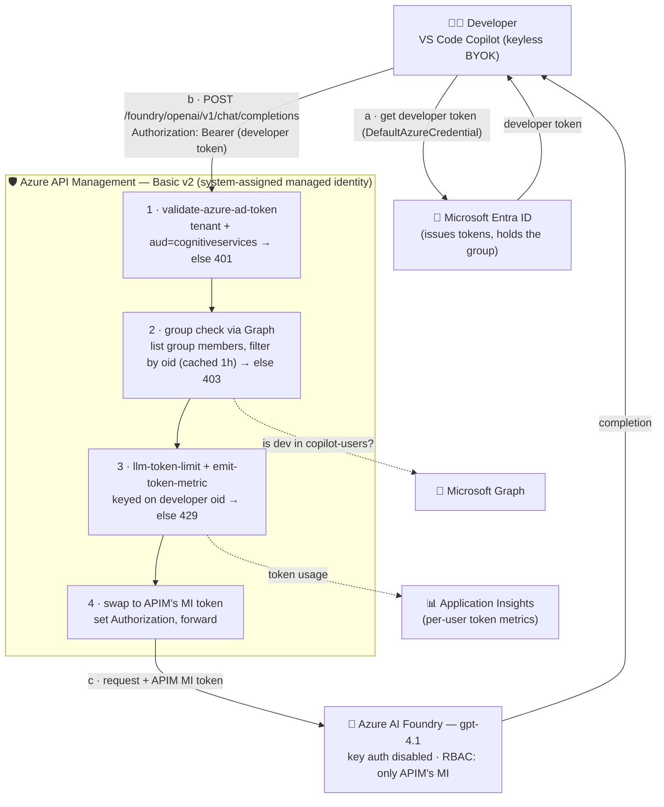
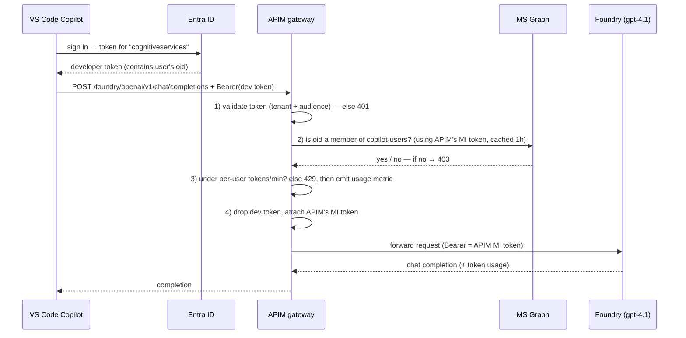
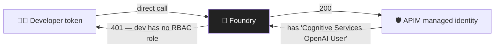
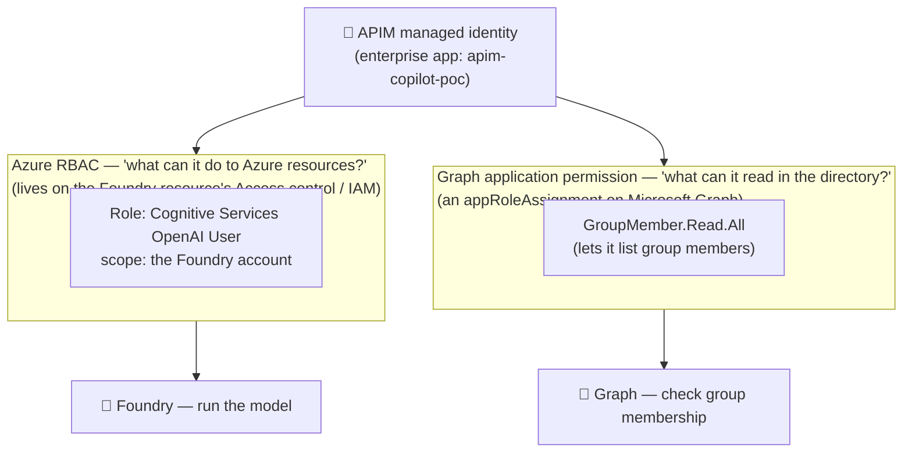

# Option A — MI-swap (identity-enforced no-bypass)

> Part of [Governed GitHub Copilot → Private Foundry via APIM](../README.md). This is **Option A**:
> APIM swaps the developer's token for its **own managed identity** to call Foundry, so **identity**
> (not the network) makes the gateway non-bypassable — which lets Foundry stay **public**. For the
> network-enforced alternative (developer-identity pass-through to a **private** Foundry), see
> [`infra-passthrough/`](../infra-passthrough/README.md).

A proof of concept that lets developers use **our own Azure AI Foundry model inside GitHub
Copilot**, while enforcing four things that don't come together out of the box:

1. **Entra-only auth, no API keys** — developers never hold a model key.
2. **Per-user authorization** — only members of an approved security group may use it.
3. **Central governance** — per-developer token limits + usage metering for cost/audit.
4. **No bypass** — the model can only be reached through our gateway.

We achieve this by putting **Azure API Management (APIM)** between Copilot and Foundry. APIM
authenticates the developer, checks their group membership, meters/limits their usage, then calls
Foundry using **its own managed identity**. Foundry trusts *only* APIM's identity, so a developer
can't point their client straight at Foundry.

> **Scope note:** This PoC intentionally **skips private networking** to stay simple — Foundry is
> public (`publicNetworkAccess = Enabled`). See [Production hardening](#production-hardening) for how
> you'd lock the network down later.

---

## The core idea: two identities, two tokens

This is the one concept that makes everything else click:

| Token | Minted by | Audience | Used for |
|---|---|---|---|
| **Developer token** | the laptop (`az login` / VS Code sign-in) | `https://cognitiveservices.azure.com` | APIM uses it to answer *"who is this, and are they allowed?"* |
| **APIM managed-identity token** | Azure, for APIM | Foundry / Microsoft Graph | What actually **calls Foundry** (and reads group membership) |

APIM validates the developer's token, then **discards it** and substitutes its own to call the
backend. Developers have **no RBAC role on Foundry** — only APIM does — which is what forces every
request through the gateway.

---

## Architecture



### Request lifecycle (sequence)



### Why it can't be bypassed



Only APIM's managed identity holds a role on Foundry. A developer calling Foundry directly is
rejected (`401`), so the gateway — with its auth, group check, and limits — is the only way in.

---

## Components

| Component | Name (this PoC) | Role |
|---|---|---|
| Copilot client | VS Code `azure` BYOK vendor | Acquires the developer's Entra token; sends requests to APIM |
| Entra ID | tenant `<tenant-id>` | Issues developer + APIM tokens; holds the `copilot-users` group |
| APIM | `apim-copilot-poc` (Basic v2) | The gateway: validate → authorize → meter/limit → MI-swap → forward |
| Microsoft Graph | (first-party) | Answers the group-membership question |
| Foundry | `cog-copilot-poc` / `gpt-4.1` | Hosts the model; trusts only APIM's MI; key auth disabled |
| App Insights | `appi-copilot-poc` | Receives per-`oid` token metrics for dashboards/chargeback |

**Gateway URL:** `https://apim-copilot-poc.azure-api.net/foundry/openai/v1/chat/completions`

---

## Identity & permissions (the part that confuses everyone)

APIM's managed identity (the `apim-copilot-poc` "enterprise application" in Entra) is granted access
in **two completely separate systems**:



- **Azure RBAC** (step 5 in `deploy.sh`) → call the model. Granted on the **Foundry resource**.
- **Graph app permission** (step 6) → read group membership. Granted as an **appRoleAssignment** on
  Microsoft Graph, admin-consented.

These are why the same identity shows its grants in two different places in the portal.

---

## Repository layout

This folder (`infra/`) holds **Option A**:

```
infra/
├── deploy.sh                      # one-shot reproducible deploy (heavily commented)
├── apim.json                      # ARM template: APIM Basic v2 + system-assigned MI
├── apim-policy.xml                # the inbound gate (auth → group → limit/meter → MI swap)
├── test-gateway.sh                # end-to-end validation via curl (device-code; see note on MFA)
├── copilot-cli.env.sh             # Copilot CLI BYOK env
└── chatLanguageModels.snippet.json# VS Code BYOK model entry to paste
└── README.md                      # this file
```

Repo root: [`README.md`](../README.md) (overview of both options) · [`infra-passthrough/`](../infra-passthrough/README.md) (Option B) · [`plan.md`](../plan.md) (original design write-up).

---

## Deploy it

```bash
az login              # as a subscription Owner who is also an Entra admin
bash infra/deploy.sh  # ~5–10 min (APIM provisioning dominates)
```

`deploy.sh` is commented step-by-step. In short it: creates the RG → Foundry + `gpt-4.1` → App
Insights → APIM (Basic v2 + managed identity) → grants the MI access to Foundry (RBAC) and Graph
(group read) → defines the API with no subscription key → wires App Insights → applies the policy.

**Tear it down:** `bash infra/cleanup.sh` (deletes the RG + purges the soft-deleted Foundry/APIM;
add `-y` to skip the confirmation prompt).

---

## Use it from VS Code Copilot

1. Add this to `%APPDATA%\Code\User\chatLanguageModels.json` (also in
   `infra/chatLanguageModels.snippet.json`):

   ```json
   {
     "name": "Foundry-via-APIM",
     "vendor": "azure",
     "models": [
       {
         "id": "gpt-4.1",
         "name": "gpt-4.1 (governed)",
         "url": "https://apim-copilot-poc.azure-api.net/foundry/openai/v1/chat/completions",
         "toolCalling": true, "vision": true,
         "maxInputTokens": 128000, "maxOutputTokens": 16000
       }
     ]
   }
   ```
2. In Copilot Chat → **model picker → Manage Models → Azure**, leave the **API key blank** (keyless
   Entra). Sign in as a user **in the `copilot-users` group**.
   - To switch the account it uses without signing others out: **Extensions view → GitHub Copilot
     Chat → gear → Account Preferences**.
3. Select **"gpt-4.1 (governed)"** and chat. (Inline grey-text completions stay GitHub-hosted — only
   chat/agent traffic is governed; this is expected.)

---

## Adding models, the model router, and the Responses API

The gateway is **model-agnostic** — one APIM operation carries any model (the client picks via the
request body's `model` field), and the policy keys on the *user*, not the model. So:

- **More models** — deploy another model in the same Foundry account; it flows through the same
  governed gateway with **zero APIM changes**. Just add a VS Code entry with the new deployment name.
- **Model router** (`model-router`, deployed here) — a single deployment that **auto-selects the best
  underlying model per prompt** (Balanced/Quality/Cost modes). Call it with `"model": "model-router"`;
  each response's `model` field reveals which model actually answered (we've seen `gpt-5-nano`,
  `gpt-5-mini`, `gpt-5.4-mini`, `gpt-oss-120b`, …).
- **Responses API** — exposed at `/foundry/openai/v1/responses` (same gate applies). For the VS Code
  `azure` vendor, Responses is cleanest via the Copilot CLI/SDK `wire_api: responses` or a custom
  endpoint; plain chat uses `/chat/completions`.

### ⚠️ The model-router endpoint split (and how the gateway absorbs it)

model-router serves its **two APIs on two different Azure endpoints** — verified empirically *and*
reproduced with Microsoft's own SDK (`AIProjectClient.get_openai_client()`):

| model-router via… | `/chat/completions` | `/responses` |
|---|---|---|
| Classic **data plane** (`…openai.azure.com`, aud `cognitiveservices`) | ✅ | ❌ 400 |
| Foundry **project** endpoint (`…/api/projects/…`, aud `ai.azure.com`) | ❌ 401 | ✅ |

Named models (e.g. `gpt-4.1`) work on **both**; only `model-router` is split. This mirrors Microsoft's
own docs, whose [model-router how-to](https://learn.microsoft.com/azure/foundry/openai/how-to/model-router#test-model-router-with-foundry-responses-and-chat-completions)
shows Responses via the **`AIProjectClient`** (project endpoint) and Chat Completions via the
**`AzureOpenAI`** client (data-plane endpoint) — two different clients/endpoints, one per API.

**The gateway handles it with path-based routing** (policy step 4): requests to `…/responses` go to
the **project** backend (MI audience `ai.azure.com`); everything else goes to the **data-plane**
backend (MI audience `cognitiveservices`). Result — `model-router` works on **both** chat and
Responses through the one governed endpoint (validated: all four combos return 200). Requires a
**Foundry project** (`copilot-proj`, created by `deploy.sh`) and the APIM MI to hold **Cognitive
Services User** (for the project/`ai.azure.com` hop) in addition to **Cognitive Services OpenAI User**.

Per-request metering carries a **`model` dimension** so you can break usage down by model in App
Insights (and by `oid` for per-developer chargeback).

## Using the GitHub Copilot CLI (BYOK) — confirmed working

The [Copilot CLI](https://docs.github.com/copilot) (`npm i -g @github/copilot`) drives the governed
gateway in **BYOK mode** — and notably **no GitHub login is required** in that mode. It's env-var
driven (`infra/copilot-cli.env.sh`).

### Keyless (recommended)

Use the **`azure`** provider type with **no token set** — the CLI acquires the Entra token itself via
`DefaultAzureCredential`. The developer just signs into `az` as a `copilot-users` member (or runs under
a managed identity / service principal); there's nothing to paste or refresh.

```bash
az login   # as a copilot-users member
export COPILOT_PROVIDER_BASE_URL="https://apim-copilot-poc.azure-api.net/foundry/openai/v1/"
export COPILOT_PROVIDER_TYPE="azure"
export COPILOT_PROVIDER_WIRE_API="completions"
export COPILOT_MODEL="model-router"     # or gpt-4.1
copilot -p "explain this repo" --allow-all-tools
```

`DefaultAzureCredential` mints a token for scope `https://cognitiveservices.azure.com/.default` — exactly
the audience our gateway validates — picking up `az login`, a managed identity, or
`AZURE_CLIENT_ID/TENANT_ID/CLIENT_SECRET`. Same mechanism as the
[Copilot SDK Azure managed-identity guide](https://docs.github.com/en/copilot/how-tos/copilot-sdk/setup/azure-managed-identity),
and it sidesteps the static-token chore (cf. [Limitations](#governance--operational-caveats)).

> ⚠️ Leave `COPILOT_PROVIDER_AZURE_API_VERSION` **unset**. Setting it flips the CLI to the classic
> `…/openai/deployments/<name>/…?api-version=…` wire format, which doesn't match our `/openai/v1/*`
> route → **`404`**. Unset, it calls our base URL as-is (versionless v1). *(Verified both ways.)*

### Pasted bearer token (any client)

The gateway is just an **OpenAI-compatible endpoint behind `Authorization: Bearer <token>`**, so it
needs no native `azure` provider — **any** client that lets you set a base URL + bearer token works.
Mint a token as a `copilot-users` member:

```bash
az account get-access-token --resource https://cognitiveservices.azure.com --query accessToken -o tsv
```

For the Copilot CLI that's `COPILOT_PROVIDER_TYPE="openai"` + `COPILOT_PROVIDER_BEARER_TOKEN`. A pasted
token expires in ~60–90 min and doesn't auto-refresh — re-export it, or use the keyless path above.

```bash
export COPILOT_PROVIDER_TYPE="openai"
export COPILOT_PROVIDER_BEARER_TOKEN="$(az account get-access-token --resource https://cognitiveservices.azure.com --query accessToken -o tsv)"
```

Verified (both provider types): `gpt-4.1` **and** `model-router` return governed completions, and an
**out-of-group** token is rejected with **`403`** at the CLI. The CLI is governed identically to VS Code.

### Picking the wire-api (`COPILOT_PROVIDER_WIRE_API`)

Every model works through the gateway — just match the wire-api to the model:

| Model | Use this wire-api |
|---|---|
| `gpt-4.1`, `model-router` (non-reasoning) | **`completions`** — the default; works for every model (verified ✅) |
| `gpt-5-mini`, `gpt-5.x` (reasoning) | `completions` **or** `responses` (both verified ✅) |

**`completions` is the simple, universal choice** and is what the examples above use — keep it unless you
specifically want a reasoning model's richer `responses` flow. Reach for **`responses` only with a
reasoning model**: the Copilot CLI's agent loop drives `responses` with reasoning parameters
(`reasoning.encrypted_content` + `reasoning.effort`) that non-reasoning models don't accept, so
`gpt-4.1`/`model-router` should stay on `completions` (there's no CLI flag to change this today —
adjustable BYOK reasoning effort is an [open request](https://github.com/github/copilot-cli/issues/2559)).

This is a CLI-client behaviour, **not** a gateway or model limit — the gateway serves `/responses` for any
model, e.g. a direct call to `gpt-4.1` returns `200`:

```bash
curl -s https://apim-copilot-poc.azure-api.net/foundry/openai/v1/responses \
  -H "Authorization: Bearer $TOKEN" -H 'Content-Type: application/json' \
  -d '{"model":"gpt-4.1","input":"Reply with exactly: CURL-OK"}'      # -> 200, output_text: "CURL-OK"
```

## Validation

`infra/test-gateway.sh` exercises the full matrix (it mints a token *as* the test user — note that
password/ROPC login is blocked by MFA in this tenant, so use the device-code flow / an interactive
sign-in). Verified results:

| Test | Expected | Result |
|---|---|---|
| In-group user → APIM | 200 + completion | ✅ (curl **and** VS Code Copilot) |
| Out-of-group user → APIM | 403 | ✅ |
| No token → APIM | 401 | ✅ |
| Bypass: user token straight to Foundry | 401 | ✅ |
| Exceed per-user tokens/min | 429 | ✅ (fired live in Copilot) |
| Per-user metering | metrics in App Insights | ✅ (token totals by `oid`) |

Query the per-user usage in App Insights:

```kusto
customMetrics
| where timestamp > ago(1d)
| where name in ('Total Tokens','Prompt Tokens','Completion Tokens')
| extend developer = tostring(customDimensions.oid), model = tostring(customDimensions.model)
| summarize tokens = sum(valueSum), requests = sum(valueCount) by developer, model, name
```

---

## Limitations

What this PoC (and the underlying platforms) **can't** do today. None of these are gateway bugs —
the APIM gateway serves both `/chat/completions` and `/responses` for any supported model, fully
governed; the constraints are in the **clients** and **models**.

### Client coverage (which client speaks which API)

| Client | Chat Completions | Responses API |
|---|---|---|
| **VS Code Copilot** (`azure` BYOK vendor) | ✅ gpt-4.1, model-router | ❌ vendor is chat-only — it sends `messages` + nested-`function.name` tools, so a `/responses` URL fails `400` |
| **Copilot CLI** (`completions` wire-api) | ✅ gpt-4.1, model-router | — |
| **Copilot CLI** (`responses` wire-api) | — | ✅ **reasoning models only** (e.g. `gpt-5-mini`); ❌ gpt-4.1 (non-reasoning), ❌ model-router |

- **Inline (grey-text) completions stay GitHub-hosted** — only **chat/agent** traffic is governable
  via BYOK. This can't be redirected; set the expectation up front.
- **VS Code's `azure` vendor can't use the Responses API** — it only speaks the chat-completions wire
  format. Use the `/chat/completions` model entries in VS Code.

### model-router limitations

- **Two APIs on two endpoints.** model-router serves `/chat/completions` only on the **data-plane**
  endpoint and `/responses` only on the **Foundry project** endpoint. (The gateway hides this with
  path-based routing — see [the model-router section](#-the-model-router-endpoint-split-and-how-the-gateway-absorbs-it).)
- **Use `completions` for model-router in the CLI.** The CLI's `responses` mode requests
  `reasoning.encrypted_content`, which model-router rejects (`400 Encrypted content is not supported`),
  and it only accepts `reasoning.effort` of `low`/`medium`/`high` — consistent with it routing to a
  different underlying model each turn. So **model-router runs in the CLI via `completions`** (verified
  working for both `gpt-4.1` and `model-router`).

### Governance & operational caveats

- **Streaming & token accuracy (the two policies differ).**
  - **Metering** (`llm-emit-token-metric`) records the **actual** `usage` from the response — accurate
    for normal *and* streamed responses. It's inaccurate **only if a stream is unexpectedly
    interrupted/terminated**, and streamed responses must carry usage (`stream_options.include_usage=true`;
    some models omit it otherwise — consider injecting it in policy for reliable streamed metering).
  - **Rate limiting** (`llm-token-limit`) **estimates** prompt and completion tokens whenever the
    request is streamed (`stream: true`), per Microsoft docs — so per-minute *enforcement* is
    approximate under streaming (fine for budgets/alerting; the metric itself is exact).
- **Group-check cache (1 h).** A user removed from the group keeps access until their cache entry
  expires (tune `duration` in the policy). Resetting a token-limit block requires rotating the
  `counter-key` (raising the TPM alone doesn't clear an active back-off).
- **Token acquisition needs MFA-capable flow.** Password/ROPC login is blocked by MFA in this tenant —
  use device-code or interactive sign-in to mint a developer token.
- **CLI BYOK *pasted* bearer is static.** A pasted `COPILOT_PROVIDER_BEARER_TOKEN` doesn't auto-refresh
  (~60–90 min); re-export when it expires. (VS Code's keyless path refreshes automatically.) **Avoid the
  chore entirely** with `COPILOT_PROVIDER_TYPE=azure` and *no* token set — the CLI uses
  `DefaultAzureCredential` (your `az login` / managed identity) to mint the `cognitiveservices` token
  itself; see [the CLI section](#openai-vs-azure-provider-type--both-work-azure-adds-a-keyless-option).
- **Cross-tenant.** The keyless path uses the signed-in account's **home tenant**; it won't work for
  cross-tenant testing.

### Scope (intentionally out for this PoC)

- **No private networking** — Foundry is public (`publicNetworkAccess = Enabled`); see
  [Production hardening](#production-hardening).
- **POST-only API surface** — the gateway exposes `POST /openai/v1/*`. Responses follow-up GETs
  (`/responses/{id}`) aren't wired; add a GET operation if a client needs them.

## Gotchas we hit (so you don't)

- **Graph permission for the group check.** `directoryObjects/{id}/checkMemberGroups` (app-only)
  needs the broad `Directory.Read.All`. Instead we **list the group's `transitiveMembers` filtered
  by the user's `oid`**, which works with least-privilege **`GroupMember.Read.All`**. A wrong/missing
  permission returns a `403 Authorization_RequestDenied` that *looks* like propagation lag — it isn't.
- **URL-encode `$filter` spaces** (`%20`) in APIM `set-url`, or the Graph call 500s.
- **Resetting a token-limit block.** The v2 `llm-token-limit` token-bucket persists its back-off;
  raising `tokens-per-minute` doesn't clear an active block. **Rotate the `counter-key`** (e.g.
  `tpm-v2-<oid>`) to hand everyone a fresh bucket.
- **MFA blocks password (ROPC) login** (`AADSTS50076`) — use device-code or interactive sign-in to
  mint a test token.
- **Streaming → estimated token counts.** Copilot streams, so metering/limits are approximate (fine
  for budgets, not penny-accurate chargeback).
- **App-role propagation** can take a few minutes after `deploy.sh` step 6 before the group check works.

---

## Production hardening

Not done here (deliberately), but the natural next steps:

- **Private networking** — Standard v2 + VNet integration (or Premium v2 injection), Foundry private
  endpoint + private DNS, `publicNetworkAccess = Disabled`.
- **Backend pool + circuit breaker** across multiple Foundry deployments/regions.
- **Logging policy decision** — full prompt/response payloads vs. metadata only (data governance).
- **Raise limits for scale** — per-user TPM in the policy and the Foundry deployment capacity
  (the binding ceiling is `--sku-capacity`).
